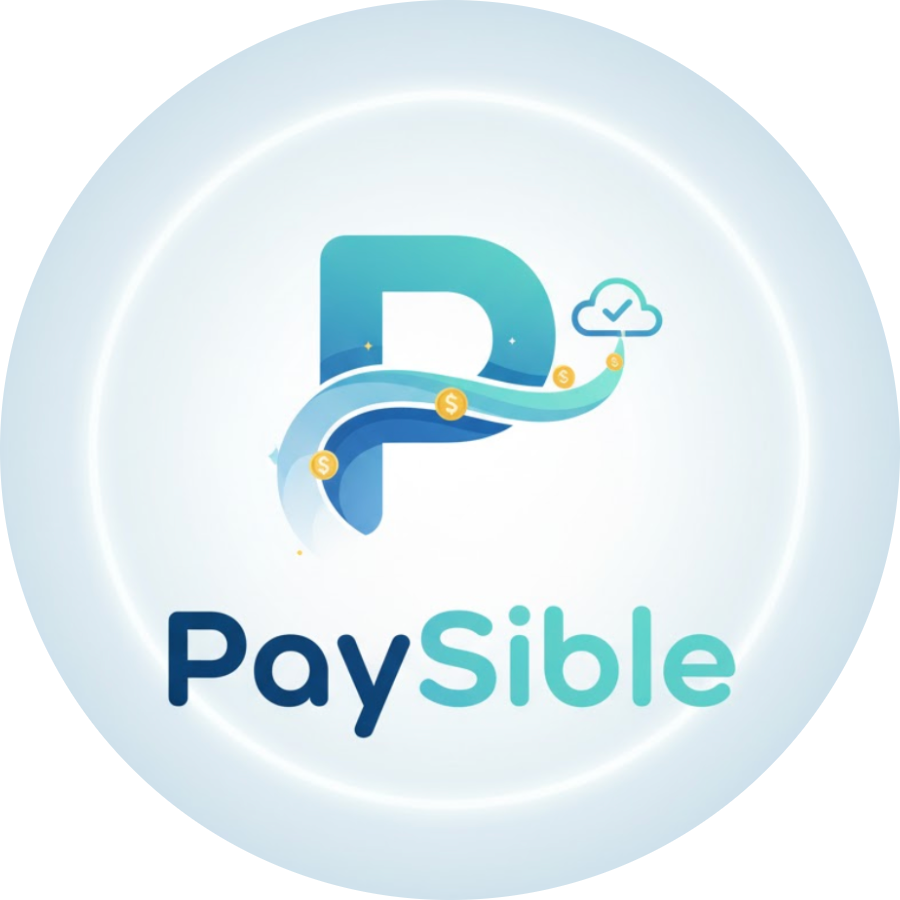
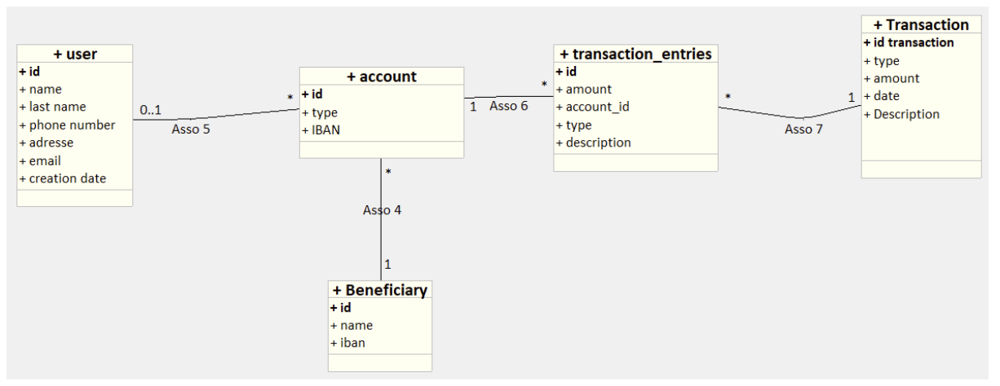

#  PAYsible - Application Bancaire Web 


**PAYsible** est une architecture bancaire web complète simulant la gestion de comptes courants et d'épargne. Conçue pour être performante, modulaire et conteneurisée, elle repose sur une logique comptable stricte (Double-Entry Bookkeeping).

---

## Table des Matières

1. [Contexte et Objectifs](#-contexte-et-objectifs)
2. [Architecture Technique](#-architecture-technique)
3. [Fonctionnalités](#-fonctionnalités)
4. [Logique Comptable (Spécificité)](#-logique-comptable-spécificité)
5. [Installation et Démarrage](#-installation-et-démarrage)
6. [Structure du Projet](#-structure-du-projet)
7. [Documentation API](#-documentation-api)
8. [Répartition des tâches](#-Répartition-des-tâches)
9. [Roadmap Technique](#-Roadmap-Technique)
10. [Auteurs](#-auteurs)

---

## Contexte et Objectifs

Ce projet (Groupe 2) vise à développer un monolithe modulaire asynchrone sous **Python (FastAPI)**.
L'objectif final est de rendre l'application portable via **Docker** et orchestrable via **Kubernetes**.

### Objectifs Clés
* Gérer un portefeuille de comptes bancaires.
* Effectuer des opérations financières sécurisées.
* Visualiser la santé financière en temps réel.
* Assurer une montée en compétence sur FastAPI et l'architecture Fullstack.

---

## Architecture Technique

L'application suit une architecture MVC modulaire séparant les routes Web (rendu HTML) des endpoints API (Données JSON).

* **Langage :** Python 3.10+
* **Framework Backend :** FastAPI (Performance & Async)
* **Moteur de Templates :** Jinja2 (Rendu côté serveur)
* **Base de Données :**
    * *Dev :* SQLite (`paysible.db`)
    * *Prod (Cible) :* PostgreSQL via Docker
* **ORM :** SQLAlchemy
* **Frontend :** Bootstrap 5, Vanilla JS (Fetch API), CSS personnalisé.
* **Serveur :** Uvicorn (ASGI)

---

## Fonctionnalités

### Authentification & Sécurité
* **Login simplifié :** Vérification de l'existence de l'email en base de données.
* **Ajout d'un utilisateur :** Possibilité de créer un utilisateur

### Gestion des Comptes
* **Visualisation :** Tableau de bord avec solde total cumulé et détail par compte.
* **CRUD Comptes :** Création (Courant/Épargne), Modification (Renommer), Clôture (Suppression).
* **IBAN :** Génération automatique d'IBAN fictifs (FR76...).

### Transactions & Virements
* **Historique :** Liste des dernières transactions avec statuts (Complété/En attente).
* **Bénéficiaires :** Ajout, modification et suppression de bénéficiaires pour les virements.
* **Calcul de Solde :** Solde calculé dynamiquement (voir section Logique Comptable).
* **Virement entre utilisateurs :** Deux utilisateurs différents peuvent se faire des virements.

### Paramètres
* **Profil Utilisateur :** Modification des informations personnelles (Nom, Tél, Adresse).

### Pages d'Erreur
* **404 :** Page personnalisée "Astronaute perdu".
* **500 :** Page interactive "Terminal/Stack Trace" avec animations CSS avancées.

---

## Logique Comptable (Spécificité)

Pour garantir une intégrité comptable absolue, le projet utilise une séparation stricte entre l'événement et l'impact financier.



1.  **Transaction (L'Événement) :** Sert de conteneur (Date, Description, Type).
**Remarque:** Le solde des comptes n'est pas persisté mais calculé dynamiquement par agrégation des transactions (Source de Vérité Unique). Ce choix garantit une intégrité comptable absolue et élimine tout risque de désynchronisation des données. Nous sommes conscients que cette approche impacte la scalabilité, augmentant la latence de calcul proportionnellement au volume de l'historique.


2.  **TransactionEntry (L'Écriture) :** Représente le mouvement réel d'argent (+/-) sur un compte spécifique.


> **Note importante :** Le solde des comptes n'est **jamais** stocké en dur dans la base de données. Il est **calculé dynamiquement** par agrégation (somme) de toutes les `TransactionEntries` liées à un compte. C'est la "Source de Vérité Unique".

---

## Installation et Démarrage

Suivez ces étapes pour lancer le projet localement.

### 1. Cloner le projet
```bash
git clone https://github.com/b3rnvrd/PAYsible.git
cd PAYsible
````

### 2\. Créer l'environnement virtuel

```bash
# Windows
python -m venv .venv
.venv\Scripts\Activate.ps1

# MacOS / Linux
python3 -m venv .venv
source .venv/bin/activate
```

### 3\. Installer les dépendances

```bash
pip install -r requirements.txt
```

### 4\. Initialiser la Base de Données (CRUCIAL)

Le fichier `seed.py` crée les tables et injecte des données de test (Utilisateurs : Elon Musk, Jeff Bezos, etc.) pour permettre la connexion.

```bash
python seed.py
```

*Vous devriez voir : "✅ 3 Utilisateurs créés", "✅ 4 Comptes bancaires créés", "🚀 TOUT EST PRÊT \!"*

vous pourrez vous connecter à l'application avec les comptes de démonstration suivants

| Utilisateur | Email de connexion | Description |
| :--- | :--- | :--- |
| **Elon Musk** | `client@paysible.com` | **Compte Principal** (Nombreuses transactions & comptes) |
| **Jeff Bezos** | `jeff@amazon.com` | Utilisateur secondaire |
| **Bernard Arnault** | `bernard@lvmh.com` | Utilisateur secondaire |

### 5\. Lancer le serveur

```bash
uvicorn app.main:app --reload
```

### 6\. Accéder à l'application

  * **URL :** [http://127.0.0.1:8000](http://127.0.0.1:8000)
  * **Compte de démo :** `client@paysible.com`

-----

### 7\. Structure du Projet

```
PAYsible/
├── app/
│   ├── api/                # Logique API REST (JSON)
│   │   ├── endpoints/      # Routes par domaine (users, accounts, beneficiaries)
│   │   └── routers.py      # Aggregateur des routes API
│   ├── core/               # Configuration (Database engine)
│   ├── models/             # Modèles SQLAlchemy (User, Account, Transaction...)
│   ├── web/                # Routes Frontend (Rendu HTML Jinja2)
│   └── main.py             # Point d'entrée FastAPI
├── static/
│   ├── css/                # Styles (styles.css, settings.css, 500.css)
│   ├── img/                # Images (Logo, Backgrounds 404/500, ModèleER)
│   └── js/                 # Scripts JS (Fetch API pour les pages dynamiques)
├── templates/              # Templates HTML (Jinja2)
│   ├── pages/              # Pages spécifiques (home, login, settings...)
│   ├── index.html          # Page d'accueil publique (Landing Page)
│   ├── 404.html            # Erreur Client
│   ├── 500.html            # Erreur Serveur
│   └── base.html           # Layout principal (Navbar, Footer)
├── paysible.db             # Base de données SQLite (générée)
├── seed.py                 # Script de peuplement de la BDD
└── requirements.txt        # Dépendances Python
```

-----

## Documentation API

Une documentation interactive (Swagger UI) est générée automatiquement par FastAPI.

  * **Swagger UI :** [http://127.0.0.1:8000/docs](http://127.0.0.1:8000/docs)

### Principaux Endpoints

| Méthode | URL | Description |
| :--- | :--- | :--- |
| `GET` | `/api/users/me/` | Profil utilisateur connecté |
| `GET` | `/api/accounts/` | Liste des comptes |
| `POST` | `/api/accounts/` | Création de compte |
| `GET` | `/api/accounts/{id}/balance/` | Calcul du solde temps réel |
| `GET` | `/api/beneficiaries/` | Liste des bénéficiaires |

-----


### 8\. Répartition des tâches
Nous avons opté pour une approche transversale où chaque membre de l'équipe intervient sur l'ensemble de la stack technique (Front-end et Back-end).
Ce choix stratégique vise deux objectifs :
Assurer une montée en compétence collective sur le framework FastAPI.
Permettre à chacun de maîtriser la chaîne complète de développement, de la gestion des données à l'interface utilisateur.


### 9\. Roadmap Technique
**Phase 1 : Développement (Séances 1 à 3)**
Objectif : construire les fondations de l’application web Django et API

**Séance 1: Initialisation du projet**
* Création du projet Django + structure de l’application ( ex: accounts, transactions, dashboard )
* Mise en place du modèle de données
* Configuration de la base MySQL locale et tests CRUD de base via l’interface admin Django.

**Séance 2: API & pages principales**
* Développement de l’API REST (Django REST Framework).
* Création des endpoints pour comptes et transactions.
* Début du front-end (page d’accueil + authentification simplifiée).
* Vérification du lien entre API ↔ Front-end.


**Séance 3: Dashboard & finalisation du front-end**
* Ajout du dashboard de dépenses
* Pages : solde, bénéficiaires, paramètres, erreurs 404/500.
* Tests fonctionnels : création compte, retrait, transfert.
* Validation du prototype complet avant conteneurisation.

**Phase 2 : Conteneurisation (Séances 4 à 6)**
Objectif : rendre l’application portable et exécutable dans des conteneurs Docker.

**Séance 4 & 5: Docker et BDD**
* Création du Dockerfile pour le back-end Django.
* Création du docker-compose.yml (services : web, db).
* Tests du build et du lancement de l’application.
* Ajout de volume pour la base de données

**Séance 6: Tests d’intégration**
*Lancement complet du projet en environnement conteneurisé.
* Tests CRUD
* Documentation technique Docker (README).

# **Phase 3 : Architecture distribuée et Kubernetes (Séances 7 à 9)**
Objectif : déployer et orchestrer l’application dans un environnement distribué. (1 pod?)

**Séance 7 & 8: Kubernetes**
* Découverte du pod, services et déploiements.
* Création des manifestes (deployment.yaml, service.yaml).
* Premier déploiement local (avec Minikube?)
* Monitoring basique avec kubectl.

**Séance 9: Finalisation architecture distribuée**
* Intégration des variables d’environnement et secrets.
* Documentation de l’architecture (schéma global).
* Préparation du dépôt Git final.

### 10\. Auteurs

**Groupe 2**

  * Sonia Abderrahmane

  * Ilyes Belkhir

  * Eliott Colson

  * Théo Garnaud

  * Alexis Scaglia

  * Yannick Zheng

<!-- end list -->
